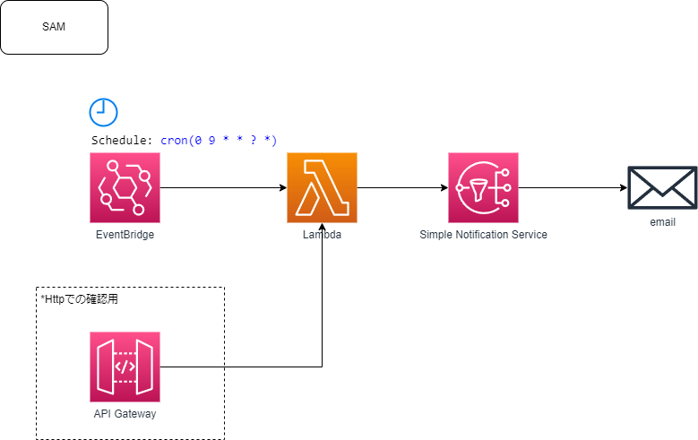

# AWS Cost 通知

## 基本

AWS Cost Explorer API を利用して、AWS のコストを取得し、通知する。

## Line への通知

## Skype への通知 (断念...)

- Azure Bot の作成 Skype チャネルの作成
  BotFramework を利用してプログラミングが必要。
  Bot Framework Emulator を利用してローカルで動作確認が可能だが、WSL を利用している場合は、localhost にアクセスできないため工夫が必要。
  AppService にデプロイも必要。
  手順が多いので断念。。。
